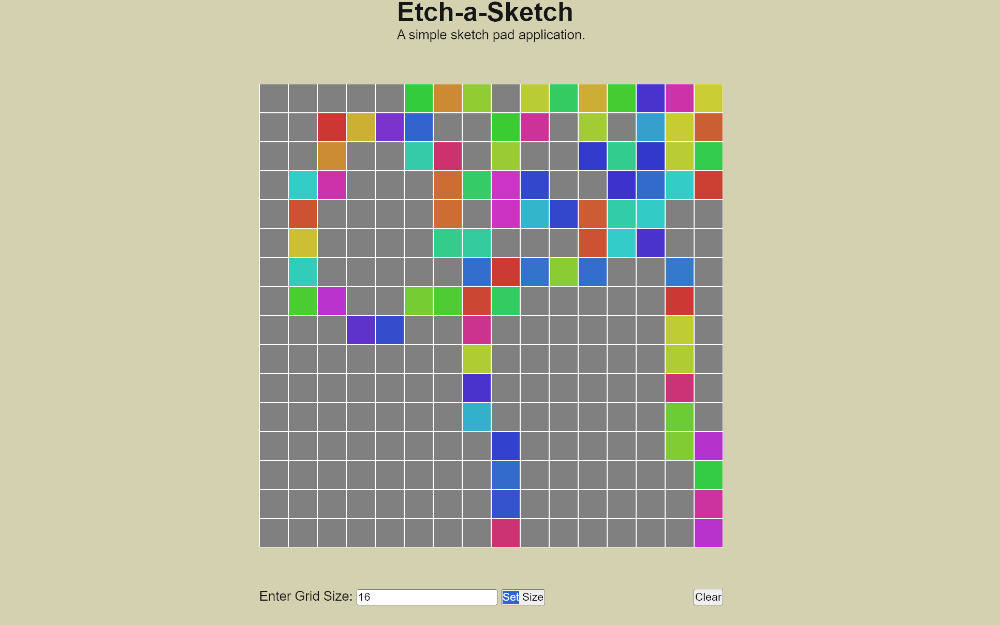

# Etch-A-Sketch

A simple sketchpad projects built using basic HTML, CSS and Javascript

## Program Screenshot

## Tools
- HTML
- CSS
- Javascript

## Features
- Dynamic grid generation
- Click-drag drawing
- Resize on demand
- Clear button

[View it live](https://blackhawk19708-gif.github.io/Etch-a-Sketch-Project/)

Made by Max
